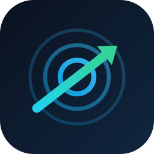
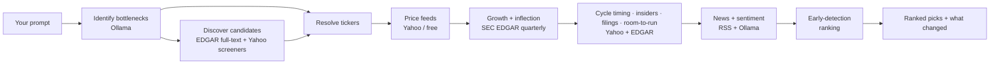

<p align="center">
  
</p>

# TrendWave 📈🌊

**Ask where an industry's bottlenecks are. Get the stocks best positioned to solve or monopolize them.**

TrendWave is a **local-first, prompt-first** desktop research tool. You type a question like
*"Where are the bottlenecks in the AI data-center buildout?"* and it quietly does the legwork —
identifies the real supply-chain chokepoints, finds the public companies best positioned to solve or
monopolize them, prices them for context, scans recent news for sentiment, and hands back a ranked
shortlist with the full thesis.

All the reasoning runs **on your machine** through [Ollama](https://ollama.com). No API keys
required, no per-token costs, no data leaving your laptop except public price/news lookups. You can
*optionally*
connect a brokerage (Robinhood or Questrade) — strictly **read-only** — so picks you already own are
flagged and you can jump straight to the right buy page.

> ⚠️ **Not financial advice.** TrendWave is a research aid. Its signals are heuristic and can be
> wrong. Verify every thesis against the linked sources before making any decision.

## How it works 🧠



TrendWave ships in **Early-detection** mode by default: it tries to surface opportunities *before*
the boom — including names you didn't prompt for — rather than only validating ones you already
supplied. A single switch (**Settings → Ranking mode → Legacy**) restores the original
trailing-fundamentals ranking byte-for-byte.

1. **Identify bottlenecks** — the local model reasons about current chokepoints (scarce components,
   limited capacity, single-source suppliers, logistics constraints) and which public companies are
   best positioned to solve or monopolize them.
2. **Discover candidates** — beyond the names the model proposes, a screener surfaces more via **SEC
   EDGAR full-text search** on the bottleneck terms and **Yahoo screeners**, so tickers and spinoffs
   the local model never heard of (e.g. a recent relisting) can still appear. Each pick is tagged
   with how it was found.
3. **Validate & price** — proposed tickers are checked against free price feeds and priced for
   context. Price is never a filter — large caps are welcome if they're the dominant beneficiary.
4. **Research growth & inflection** — for each ticker TrendWave pulls **audited fundamentals from SEC
   EDGAR** (multi-year revenue & earnings) for a data-derived growth score, and in Early-detection
   mode also reads **quarterly** filings for **cyclical inflection** (revenue troughs and
   re-acceleration) plus **estimate revisions** — so a cyclical scores highest near the *bottom* of
   its cycle, where the upside is, not the top.
5. **Cycle timing, insiders & filings** — Early-detection adds a **timing label** (Early / Building /
   Extended / Late) from multi-timeframe price action and relative strength, **insider-buying**
   clusters (SEC Form 4), and **filing evidence** (8-K / 10-Q capacity & pricing-power language).
6. **Room to run** — Early-detection also weighs **size**: it favors the small/mid-cap sweet spot
   (~$1B-$20B) with enough liquidity to trade, so names that can still *multiply* outrank mega-caps
   that have already had their run. It reuses the market cap pulled with fundamentals and stays
   neutral when size is unknown.
7. **News & sentiment** — recent headlines are pulled per ticker and scored locally by the model.
8. **Rank & track changes** — a transparent blend combines positioning, growth and the
   early-detection signals; each pick can explain its score. Re-running a watchlist shows **what
   changed since last run** (new entrants, rank/score moves, timing shifts). Share price is never a
   filter.

Progress streams live to the UI, and you can **save any search as a watchlist** to re-run with one
click later.

## Portfolio awareness & one-click Buy (optional) 🔗

TrendWave is a research tool first, but it can meet you where you actually trade — always **read-only**.

- **Connect a brokerage.** Link **Robinhood** (secure in-browser sign-in via OAuth 2.1 + PKCE) or
  **Questrade** (paste a refresh token from Questrade's API centre). TrendWave only ever reads your
  **positions and balances** — it never places, modifies, or cancels an order. Robinhood is reached
  through its official **Agentic trading (MCP)** endpoint behind a conservative read-only tool
  allow-list; Questrade uses its REST API (retail apps can't place trades at all).
- **"In your portfolio" badges.** Once connected, any ranked pick you already hold — in *either*
  broker — is flagged, and a portfolio panel shows each position's value, day change and a sparkline.
  Ownership is context only; it never affects the ranking.
- **Biometric lock.** Revealing a saved broker session is gated behind **Touch ID / Windows Hello**
  (on by default). It degrades gracefully to unlocked on machines without biometric hardware.
- **Keychain-only tokens.** Broker credentials live in your **OS keychain** (macOS Keychain, Windows
  Credential Manager, or libsecret) — never in the database, a config file, or the repo. Disconnecting
  deletes them.
- **One-click Buy.** Every pick has a read-only **Buy** button that deep-links the right ticker on your
  broker's site (Robinhood, Fidelity, Schwab, E\*TRADE, Webull, Questrade, Wealthsimple). For Canadian
  brokers it prefers a same-security **Canadian interlisting** so you trade in CAD with no FX conversion.

## Tech stack 🛠️

- **Shell:** Tauri v2 (Rust core + web frontend)
- **Backend:** Rust — `tokio` (async pipeline), `reqwest` (HTTP), `rusqlite` (local SQLite),
  `feed-rs` (RSS), `thiserror` (typed errors), `chrono`
- **Intelligence:** local Ollama model (default `llama3.1:8b`)
- **Brokerage (optional, read-only):** a small built-in **MCP client** (Streamable HTTP) for
  Robinhood's Agentic trading server and a REST client for Questrade, with `keyring` for OS-keychain
  token storage and `robius-authentication` for Touch ID / Windows Hello. Robinhood sign-in is an
  OAuth 2.1 PKCE flow (`sha2` / `base64` / `rand`).
- **Frontend:** React + TypeScript + Tailwind CSS, built with Vite; light/dark theme applied before
  first paint (no flash)
- **Data:** free public endpoints — Yahoo Finance (prices, search, RSS news, screeners; forward P/E
  & analyst targets) and **SEC EDGAR** (audited annual & quarterly fundamentals, full-text search,
  insider Form 4, 8-K/10-Q filings). No keys required. You can *optionally* bring your own paid-data
  key (e.g. Financial Modeling Prep) for cleaner estimates — stored in the OS keychain, never the
  database; the app stays fully functional without one. Connecting a brokerage adds read-only calls
  to *your own* Robinhood/Questrade account only.

## Getting started 🚀

### Prerequisites

- Node.js and npm
- Rust toolchain
- [Ollama](https://ollama.com) installed and running
- Tauri system prerequisites for your platform

### 1. Start Ollama and pull a model

```bash
ollama serve              # if it isn't already running
ollama pull llama3.1:8b   # or any instruction-following model
```

### 2. Run the app

```bash
npm install
npm run tauri dev
```

TrendWave opens to a single prompt window. Type a question (or click an example), and watch it work.

### Other commands

```bash
npm run build                                   # build the frontend only
cargo test --manifest-path src-tauri/Cargo.toml # run the Rust unit tests
cargo check --manifest-path src-tauri/Cargo.toml
```

## Install & automatic updates ⬇️

TrendWave ships as a **self-updating desktop app** — install it once and it keeps itself current.

### Install

**macOS** — grab the latest `.dmg` from the
[Releases page](https://github.com/daryn-brown/TrendWave/releases/latest), open it, and drag
**TrendWave** into **Applications**. The app isn't signed with an Apple Developer certificate, so the
first launch needs a one-time approval: **right-click the app → Open → Open** (or run
`xattr -dr com.apple.quarantine /Applications/TrendWave.app`).

**Windows** — grab the latest `-setup.exe` from the
[Releases page](https://github.com/daryn-brown/TrendWave/releases/latest) and run it. The installer
isn't signed with an Authenticode certificate yet, so SmartScreen may warn about an unknown publisher:
click **More info → Run anyway**.

### Updating

Every merge to `main` triggers the [`release` workflow](.github/workflows/release.yml), which builds
**signed macOS (universal `.dmg`) and Windows (`.exe`) bundles** and publishes them to the same GitHub
Release. Both platforms share one multi-platform updater manifest (`latest.json`), so a single version
bump ships to Mac and Windows in lockstep. The running app checks that release on launch — and whenever
you click **Check for updates** in the sidebar. When a newer build exists you get an **Update
available** banner: click **Download &amp; install**, then **Restart now**. Each update is verified
against an embedded public key before it is applied.

The release version is the committed `version` in `src-tauri/tauri.conf.json` (kept in lockstep with
`package.json` and `src-tauri/Cargo.toml`) — that exact value is what ships and what installed apps
compare against. **Bump it before merging to `main`.** The workflow refuses to publish if a release
for that version already exists, so a forgotten bump fails the build instead of silently re-shipping a
stale version.

### Maintainer setup (one-time)

Updates are signed with a [minisign](https://jedisct1.github.io/minisign/) keypair created by
`npm run tauri signer generate`. The **public** key lives in `src-tauri/tauri.conf.json`; the
**private** key and its password are stored as the repo secrets `TAURI_SIGNING_PRIVATE_KEY` and
`TAURI_SIGNING_PRIVATE_KEY_PASSWORD` (used by the workflow). Keep the private key safe and out of
version control — without it you can't publish updates that installed apps will accept.

## Settings ⚙️

Open **Settings** from the sidebar to tune:

| Setting | Default | Meaning |
|---|---|---|
| Ollama model | `llama3.1:8b` | Any locally installed model |
| Ollama endpoint | `http://localhost:11434` | Where the local server listens |
| Max results | `8` | Cap on returned picks |
| Ranking mode | Early detection | **Early detection** adds forward signals (inflection, cycle timing, estimate revisions, insider buys, filing evidence, room-to-run) and screener discovery; **Legacy** restores the original trailing-fundamentals ranking byte-for-byte |
| Market-data source | Free | Free (SEC EDGAR + Yahoo) by default; optionally bring your own paid key (FMP) for cleaner estimates, stored in the OS keychain |
| Scan news & sentiment | on | Pull headlines and score sentiment (slower) |
| Research real growth | on | Pull SEC EDGAR + Yahoo fundamentals to drive the growth score (slower) |
| Require biometric unlock | on | Gate a connected broker session behind Touch ID / Windows Hello (auto-off where unsupported) |

Settings and watchlists persist in a local SQLite file (`trendwave.db`) in your OS app-data
directory.

## Project structure 🗂️

```text
TrendWave/
├── project_spec.md      # Architecture and design notes
├── src/                 # React frontend (prompt UI)
│   ├── App.tsx          # Orchestration + layout
│   ├── components.tsx   # Presentational components
│   ├── api.ts           # Typed Tauri command bridge
│   ├── brokers.ts       # Read-only Buy routing (broker deep-links, FX-aware)
│   ├── theme.ts         # Light/dark theme (persisted, no flash on load)
│   ├── updater.ts       # In-app auto-update helpers
│   └── types.ts         # Shared types (mirror of the Rust models)
├── src-tauri/src/       # Rust backend
│   ├── lib.rs           # App bootstrap, state, command registration
│   ├── commands.rs      # Tauri IPC commands
│   ├── research.rs      # The bottleneck → ranking pipeline
│   ├── scoring.rs       # Scoring modes + weighted blend (Legacy / Early detection)
│   ├── providers.rs     # Data-provider abstraction (free default + optional BYO-key paid)
│   ├── screener.rs      # Candidate discovery (EDGAR full-text + Yahoo screeners)
│   ├── inflection.rs    # Quarterly EDGAR inflection + estimate-revision signals
│   ├── technical.rs     # Cycle timing / relative strength (Early/Building/Extended/Late)
│   ├── filings.rs       # Insider Form 4 + 8-K/10-Q keyword signals (EDGAR)
│   ├── convexity.rs     # Room-to-run / convexity (market-cap sweet spot + liquidity)
│   ├── changes.rs       # Run-over-run change detection (what changed since last run)
│   ├── ollama.rs        # Local Ollama client
│   ├── feeds.rs         # Free price + news feeds (Yahoo)
│   ├── fundamentals.rs  # Real growth research (SEC EDGAR + Yahoo enrichment)
│   ├── mcp.rs           # Minimal MCP client (Streamable HTTP transport)
│   ├── robinhood.rs     # Read-only Robinhood Agentic (MCP) integration
│   ├── questrade.rs     # Read-only Questrade REST integration
│   ├── oauth.rs         # OAuth 2.1 PKCE + OS-keychain token storage
│   ├── biometric.rs     # Touch ID / Windows Hello unlock gate
│   ├── db.rs            # SQLite persistence
│   ├── model.rs         # Shared serializable types
│   ├── settings.rs      # User settings
│   └── error.rs         # Typed, serializable errors
├── .github/workflows/
│   └── release.yml      # Build + publish signed auto-update releases
└── README.md
```

## Privacy 🔒

TrendWave is local-first by design. Your prompts and results never leave your machine. The only
outbound network calls are to free, public endpoints — Yahoo Finance (prices, news & screeners) and
SEC EDGAR (audited fundamentals, full-text search, insider & company filings) — and to your local
Ollama server. SEC requests send a descriptive User-Agent with a contact address, per SEC's
fair-access policy. If you opt into a paid data provider, its API key is stored in your **OS
keychain** (never the database or a file) and paid data is not written to saved-watchlist caches.

If you connect a brokerage, TrendWave also talks to **your own** account at that broker — Robinhood
(`agent.robinhood.com`, `api.robinhood.com`) or Questrade (`login.questrade.com`,
`api*.iq.questrade.com`) — and nowhere else. Those connections are **read-only** (positions and
balances), their tokens are stored in your **OS keychain** (never the database or a file), and a
Touch ID / Windows Hello check gates a saved session by default. Disconnecting deletes the stored token.
