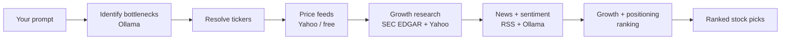

# TrendWave 📈🌊

**Ask where an industry's bottlenecks are. Get the stocks best positioned to solve or monopolize them.**

TrendWave is a **local-first, prompt-first** desktop research tool. You type a question like
*"Where are the bottlenecks in the AI data-center buildout?"* and it quietly does the legwork —
identifies the real supply-chain chokepoints, finds the public companies best positioned to solve or
monopolize them, prices them for context, scans recent news for sentiment, and hands back a ranked
shortlist with the full thesis.

All the reasoning runs **on your machine** through [Ollama](https://ollama.com). No API keys, no
per-token costs, no data leaving your laptop except public price/news lookups.

> ⚠️ **Not financial advice.** TrendWave is a research aid. Its signals are heuristic and can be
> wrong. Verify every thesis against the linked sources before making any decision.

## How it works 🧠



1. **Identify bottlenecks** — the local model reasons about current chokepoints (scarce components,
   limited capacity, single-source suppliers, logistics constraints) and which public companies are
   best positioned to solve or monopolize them.
2. **Validate & price** — proposed tickers are checked against free price feeds and priced for
   context. Price is never a filter — large caps are welcome if they're the dominant beneficiary.
3. **Research real growth** — for each ticker TrendWave pulls **audited fundamentals from SEC EDGAR**
   (multi-year revenue & earnings → real YoY growth, CAGR, profitability), opportunistically enriched
   with Yahoo forward P/E and analyst-target upside. This yields a **data-derived growth score** that
   replaces the model's guesswork about upside.
4. **News & sentiment** — recent headlines are pulled per ticker and scored locally by the model.
5. **Rank** — a transparent score weights **real growth potential highest (35%)**, then competitive
   positioning (bottleneck severity + moat), with sentiment and momentum as tie-breakers. Share price
   is never a filter.

Progress streams live to the UI, and you can **save any search as a watchlist** to re-run with one
click later.

## Tech stack 🛠️

- **Shell:** Tauri v2 (Rust core + web frontend)
- **Backend:** Rust — `tokio` (async pipeline), `reqwest` (HTTP), `rusqlite` (local SQLite),
  `feed-rs` (RSS), `thiserror` (typed errors)
- **Intelligence:** local Ollama model (default `llama3.1:8b`)
- **Frontend:** React + TypeScript + Tailwind CSS, built with Vite
- **Data:** free public endpoints — Yahoo Finance (prices, search, RSS news; forward P/E & analyst
  targets) and **SEC EDGAR** (audited fundamentals). No keys required.

## Getting started 🚀

### Prerequisites

- Node.js and npm
- Rust toolchain
- [Ollama](https://ollama.com) installed and running
- Tauri system prerequisites for your platform

### 1. Start Ollama and pull a model

```bash
ollama serve              # if it isn't already running
ollama pull llama3.1:8b   # or any instruction-following model
```

### 2. Run the app

```bash
npm install
npm run tauri dev
```

TrendWave opens to a single prompt window. Type a question (or click an example), and watch it work.

### Other commands

```bash
npm run build                                   # build the frontend only
cargo test --manifest-path src-tauri/Cargo.toml # run the Rust unit tests
cargo check --manifest-path src-tauri/Cargo.toml
```

## Settings ⚙️

Open **Settings** from the sidebar to tune:

| Setting | Default | Meaning |
|---|---|---|
| Ollama model | `llama3.1:8b` | Any locally installed model |
| Ollama endpoint | `http://localhost:11434` | Where the local server listens |
| Max results | `8` | Cap on returned picks |
| Scan news & sentiment | on | Pull headlines and score sentiment (slower) |
| Research real growth | on | Pull SEC EDGAR + Yahoo fundamentals to drive the growth score (slower) |

Settings and watchlists persist in a local SQLite file (`trendwave.db`) in your OS app-data
directory.

## Project structure 🗂️

```text
TrendWave/
├── project_spec.md      # Architecture and design notes
├── src/                 # React frontend (prompt UI)
│   ├── App.tsx          # Orchestration + layout
│   ├── components.tsx   # Presentational components
│   ├── api.ts           # Typed Tauri command bridge
│   └── types.ts         # Shared types (mirror of the Rust models)
├── src-tauri/src/       # Rust backend
│   ├── lib.rs           # App bootstrap, state, command registration
│   ├── commands.rs      # Tauri IPC commands
│   ├── research.rs      # The bottleneck → ranking pipeline
│   ├── ollama.rs        # Local Ollama client
│   ├── feeds.rs         # Free price + news feeds (Yahoo)
│   ├── fundamentals.rs  # Real growth research (SEC EDGAR + Yahoo enrichment)
│   ├── db.rs            # SQLite persistence
│   ├── model.rs         # Shared serializable types
│   ├── settings.rs      # User settings
│   └── error.rs         # Typed, serializable errors
└── README.md
```

## Privacy 🔒

TrendWave is local-first by design. Your prompts and results never leave your machine. The only
outbound network calls are to free, public endpoints — Yahoo Finance (prices & news) and SEC EDGAR
(audited fundamentals) — and to your local Ollama server. SEC requests send a descriptive
User-Agent with a contact address, per SEC's fair-access policy.
